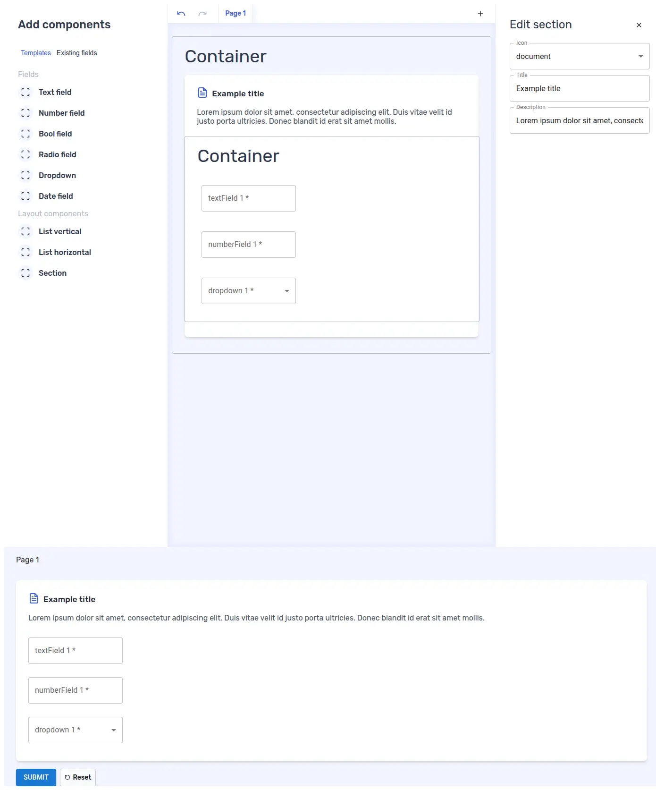

# Custom containers
Forminer offers the ability to create your own custom containers, providing greater flexibility in customizing Forminer to meet individual needs. Containers can be freely nested, allowing you to create universal containers that can be reused with both built-in and custom containers.

## Creating a custom container

Let's create an example custom container `Section` that will group items and allow you to customize 3 properties via UI:
- `icon` - selection of one of the predefined icons
- `title` - section title (next to the icon)
- `description` - section description

Create `Section.tsx` file in `src/components/containers`.

Example code for `Section.tsx` can be copied and pasted as below.

<details><summary>See the code</summary>

```tsx
import {
  type ContainerDefinition,
  LayoutPlaceholder,
  renderEdit,
  renderLive
} from 'forminer';
import { type CSSProperties } from 'react';

/** 3 predefined icons for example purposes */
const ICONS = {
  user: (
    <svg xmlns="http://www.w3.org/2000/svg" width="24" height="24" viewBox="0 0 24 24" fill="none" stroke="currentColor" strokeWidth="2" strokeLinecap="round" strokeLinejoin="round">
      <path d="M19 21v-2a4 4 0 0 0-4-4H9a4 4 0 0 0-4 4v2" />
      <circle cx="12" cy="7" r="4" />
    </svg>
  ),
  form: (
    <svg xmlns="http://www.w3.org/2000/svg" width="24" height="24" viewBox="0 0 24 24" fill="none" stroke="currentColor" strokeWidth="2" strokeLinecap="round" strokeLinejoin="round">
      <rect x="3" y="3" width="18" height="18" rx="2" ry="2" />
      <line x1="9" y1="9" x2="15" y2="9" />
      <line x1="9" y1="13" x2="15" y2="13" />
      <line x1="9" y1="17" x2="13" y2="17" />
    </svg>
  ),
  document: (
    <svg xmlns="http://www.w3.org/2000/svg" width="24" height="24" viewBox="0 0 24 24" fill="none" stroke="currentColor" strokeWidth="2" strokeLinecap="round" strokeLinejoin="round">
      <path d="M14 2H6a2 2 0 0 0-2 2v16a2 2 0 0 0 2 2h12a2 2 0 0 0 2-2V8z" />
      <polyline points="14 2 14 8 20 8" />
      <line x1="16" y1="13" x2="8" y2="13" />
      <line x1="16" y1="17" x2="8" y2="17" />
      <polyline points="10 9 9 9 8 9" />
    </svg>
  )
};

// We use inline styles, but you can use whatever you want for styling
const STYLES: Record<string, CSSProperties> = {
  section: {
    backgroundColor: 'white',
    borderRadius: '8px',
    boxShadow:
      '0 4px 6px -1px rgba(0, 0, 0, 0.1), 0 2px 4px -1px rgba(0, 0, 0, 0.06)',
    paddingTop: '26px',
    paddingBottom: '26px',
    margin: '16px 26px',
  },
  sectionHeader: {
    display: 'flex',
    alignItems: 'center',
    gap: '8px',
    marginLeft: '26px',
    marginRight: '26px',
    marginBottom: '16px',
  },
  sectionIcon: {
    color: '#3d5bff',
  },
  sectionTitle: {
    fontSize: '17px',
    fontWeight: 500,
    letterSpacing: '0.3px',
    color: '#1f2937',
    margin: 0,
  },
  sectionDescription: {
    color: '#4b5563',
    marginLeft: '26px',
    marginRight: '26px',
    marginBottom: '16px',
  },
};

type IconType = keyof typeof ICONS;

/** Custom properties specific for `Section` component (related to `Section.configSchema.properties`) */
type SectionCustomProps = {
  icon: IconType | undefined;
  title: string | undefined;
  description: string | undefined;
}

/** Example of custom layout container */
export const Section: ContainerDefinition<SectionCustomProps> = {
  componentEdit: function Section({
    children,
    components,
    containers,
    depth,
    description,
    droppableId,
    icon,
    isDragging,
    path,
    schema,
    title,
    translations,
    type,
    views,
    widgets,
  }) {
    return (
      <div style={STYLES.section}>
        {(icon || title) && (
          <div style={STYLES.sectionHeader}>
            {icon && (
              <div style={STYLES.sectionIcon}>
                {ICONS[icon]}
              </div>
            )}
            <h3 style={STYLES.sectionTitle}>
              {title}
            </h3>
          </div>
        )}

        {description && (
          <p style={STYLES.sectionDescription}>
            {description}
          </p>
        )}

        {children.length === 0 ? (
          <LayoutPlaceholder
            droppableId={droppableId}
            isDragging={isDragging}
            type={type}
            translations={translations}
          />
        ) : renderEdit({
          components,
          containers,
          depth: depth + 1,
          layout: children[0],
          path: `${path}.children.0`,
          schema,
          translations,
          views,
          widgets,
        })}
      </div>
    );
  },
  componentLive: function Section({
    children,
    components,
    containers,
    depth,
    description,
    icon,
    path,
    schema,
    title,
    views,
    widgets,
  }) {
    if (!icon && !title && !description && !children.length) {
      return null
    }

    return (
      <div style={STYLES.section}>
        {(icon || title) && (
          <div style={STYLES.sectionHeader}>
            {icon && (
              <div style={STYLES.sectionIcon}>
                {ICONS[icon]}
              </div>
            )}
            <h3 style={STYLES.sectionTitle}>
              {title}
            </h3>
          </div>
        )}

        {description && (
          <p style={STYLES.sectionDescription}>
            {description}
          </p>
        )}

        {children[0] && renderLive({
          components,
          containers,
          depth: depth + 1,
          layout: children[0],
          path: `${path}.children.0`,
          schema,
          views,
          widgets,
        })}
      </div>
    );
  },
  configSchema: {
    type: 'object',
    properties: {
      icon: {
        type: "string",
        enum: ["user", "form", "document"],
      },
      title: {
        type: "string",
      },
      description: {
        type: "string",
      },
    },
  },
};
```

</details>


## Passing a custom container definition to the `Forminer` and `Form`s

We need to create `containers` containing a map of custom container definitions.

Create `containers.ts` file in `src/components/containers` containing the newly created `Section`.

```tsx
import { type ContainerDefinitions } from 'forminer';
import { Section } from './Section';

export const containers = {
  Section,
} satisfies ContainerDefinitions;
```

Now we need to pass `containers` to the `Forminer` and `Form` components as a `containers` property.

```tsx
import {
  createDefaultComponents,
  Form,
  Forminer,
  Provider,
  useForminer,
} from 'forminer';
import * as theme from 'uniforms-mui';
// highlight-next-line-added
import { containers } from './components/containers/containers';

const components = createDefaultComponents(theme);

function App() {
  const { dispatch, state } = useForminer();

  return (
    <>
      <Provider dispatch={dispatch} state={state}>
        <Forminer
          components={components}
          // highlight-next-line-added
          containers={containers}
        />
      </Provider>
      <Form
        components={components}
        // highlight-next-line-added
        containers={containers}
        definition={state.model.present}
        onSubmit={model => alert(JSON.stringify(model, null, 2))}
      />
    </>
  );
}

export default App;
```

## Result
The custom `Section` component should now be visible and ready to use. Remember that you can combine it with existing containers (e.g. `List vertical`).


