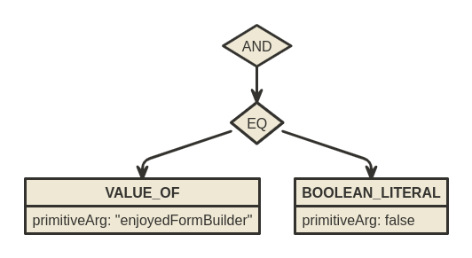
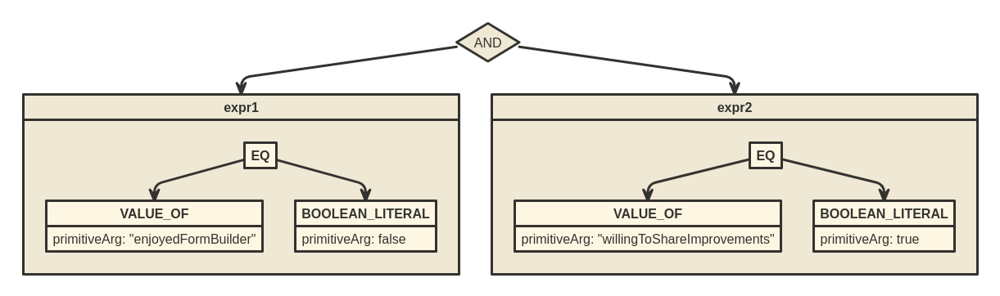

# Display If

## Expressions, operators & conditions

DisplayIf allows conditional rendering of fields. That means that a given field will be rendered only if a specified condition is met. What's important is that a condition is an expression that evaluates to either true or false. Expressions are evaluated according to the specified operators, using operands (args).

The list of supported operators is as follows:

| Expression type | Operators                                             | Number of operands |
| --------------- | ----------------------------------------------------- | ------------------ |
| Logical         | `AND`, `OR`, `NAND`, `NOR`, `XOR`                     | Multiple           |
| Comparison      | `EQ`, `NOT_EQ`, `GT`, `GTE`, `LT`, `LTE`              | Two                |
| Literal         | `BOOLEAN_LITERAL`, `NUMBER_LITERAL`, `STRING_LITERAL` | One                |
| Model           | `VALUE_OF`, `LENGTH_OF`                               | One                |

### Simple example

Let's start simple. Imagine we have a form where we ask for feedback and we want to ask about potential improvements, but only if someone is not satisfied. Take a look at the form below:


In this example, the text field is displayed only when the value of the boolean field is false. Let's take a look at the code representation of the form:

```json
{
  "views": [
    {
      "component": "AutoField",
      "fieldId": "1",
      "label": "Do you enjoy Form Builder?",
      "viewId": "1"
    },
    {
      "component": "AutoField",
      "fieldId": "2",
      "label": "How can we improve it?",
      "viewId": "2",
      "displayIf": {
        "operator": "AND",
        "args": [
          {
            "operator": "EQ",
            "args": [
              {
                "operator": "VALUE_OF",
                "args": [],
                "primitiveArg": "enjoyedFormBuilder"
              },
              {
                "operator": "BOOLEAN_LITERAL",
                "args": [],
                "primitiveArg": false
              }
            ]
          }
        ]
      }
    }
  ],
  "layouts": [
    {
      "name": "Page 1",
      "layout": {
        "kind": "Container",
        "children": [
          {
            "kind": "Field",
            "viewId": "1",
            "layoutId": "2"
          },
          {
            "kind": "Field",
            "viewId": "2",
            "layoutId": "3"
          }
        ],
        "type": "List",
        "config": {
          "variant": "vertical"
        },
        "layoutId": "1"
      }
    }
  ],
  "schema": [
    {
      "fieldId": "1",
      "name": "enjoyedFormBuilder",
      "type": "boolean",
      "required": true,
      "defaultValue": true
    },
    {
      "fieldId": "2",
      "name": "improvements",
      "type": "string",
      "required": true,
      "defaultValue": "",
      "minLength": 1
    }
  ]
}
```

Let's focus on the `displayIf`'s content defined for the text field:

```tsx
{
  "operator": "AND",
  "args": [
    {
      "operator": "EQ",
      "args": [
        {
          "operator": "VALUE_OF",
          "args": [],
          "primitiveArg": "enjoyedFormBuilder"
        },
        {
          "operator": "BOOLEAN_LITERAL",
          "args": [],
          "primitiveArg": false
        }
      ]
    }
  ]
}
```

Let's show this in a form of a diagram to see it clearer:



On the root level, there is a `AND` operator. It resolves to true once all of the child operands evaluate to true (notice that the operand is an expression, too!). In our case, there's only one child expression, `EQ`. `EQ` is a comparison expression, it takes two operands and evaluates to true if they are equal. The first operand is a `VALUE_OF` operator, which is used to evaluate a model expression. The second one is a `BOOLEAN_LITERAL` operator, which counts a literal expression. Both model and literal expressions, instead of using the child expressions (stored in the `args`), use the `primitiveArg` value to evaluate. `VALUE_OF` gets a value under a `primitiveArg` name from the model. `BOOLEAN_LITERAL` simply returns a fixed boolean value.

### More complex example

Let's expand on the previous form. Now we want to ask about potential improvements not only when someone is not satisfied, but also when he is willing to share them. Take a look:


Here's the code of the form:

```tsx
{
  "views": [
    {
      "component": "AutoField",
      "fieldId": "1",
      "label": "Do you enjoy Form Builder?",
      "viewId": "1"
    },
    {
      "component": "AutoField",
      "fieldId": "2",
      "label": "How can we improve it?",
      "viewId": "2",
      "displayIf": {
        "operator": "AND",
        "args": [
          {
            "operator": "EQ",
            "args": [
              {
                "operator": "VALUE_OF",
                "args": [],
                "primitiveArg": "enjoyedFormBuilder"
              },
              {
                "operator": "BOOLEAN_LITERAL",
                "args": [],
                "primitiveArg": false
              }
            ]
          },
          {
            "operator": "EQ",
            "args": [
              {
                "operator": "VALUE_OF",
                "args": [],
                "primitiveArg": "willingToShareImprovements"
              },
              {
                "operator": "BOOLEAN_LITERAL",
                "args": [],
                "primitiveArg": true
              }
            ]
          }
        ]
      }
    },
    {
      "component": "AutoField",
      "fieldId": "3",
      "label": "Are you willing to share the improvements?",
      "viewId": "3",
      "displayIf": {
        "operator": "AND",
        "args": [
          {
            "operator": "EQ",
            "args": [
              {
                "operator": "VALUE_OF",
                "args": [],
                "primitiveArg": "enjoyedFormBuilder"
              },
              {
                "operator": "BOOLEAN_LITERAL",
                "args": [],
                "primitiveArg": false
              }
            ]
          }
        ]
      }
    }
  ],
  "layouts": [
    {
      "name": "Page 1",
      "layout": {
        "kind": "Container",
        "children": [
          {
            "kind": "Field",
            "viewId": "1",
            "layoutId": "2"
          },
          {
            "kind": "Field",
            "viewId": "3",
            "layoutId": "4"
          },
          {
            "kind": "Field",
            "viewId": "2",
            "layoutId": "3"
          }
        ],
        "type": "List",
        "config": {
          "variant": "vertical"
        },
        "layoutId": "1"
      }
    }
  ],
  "schema": [
    {
      "fieldId": "1",
      "name": "enjoyedFormBuilder",
      "type": "boolean",
      "required": true,
      "defaultValue": true
    },
    {
      "fieldId": "2",
      "name": "improvements",
      "type": "string",
      "required": true,
      "defaultValue": "",
      "minLength": 1
    },
    {
      "fieldId": "3",
      "name": "willingToShareImprovements",
      "type": "boolean",
      "required": false
    }
  ]
}
```

Notice two things. One is that now the "_Are you willing to share the improvements?"_ field is using the same `displayIf` condition we created previously. The second thing is that the condition responsible for displaying the text field now takes into account the newly added field as well. Take a look at the diagram:



## Required only if visible

In terms of validation, forms created with FormBuilder follow the rule _the field is required only if it's visible_. It is best to see how it works with an example.

To demonstrate the thing, we will use the same form as in the "Simple example" from the "Expressions, operators & conditions" section. Please note that both fields are marked as required in the form schema. View the video below to see how the form behaves when we submit it:

[displayIfValidation.mp4](../assets/13762563.mp4)

As you can see, the `enjoyedFormBuilder` field is always present in the submitted model, as it has a default value and it's not displayed conditionally.

The `improvementsField` though is present in the submitted model only when the field is visible. Once visible, it also affects the form validation, preventing it from submitting without a value set. You can also see, that when the displayIf condition is false and the field disappears, its value is preserved in the model (when we untick the checkbox, the value is already there, so there is no need to type it again).

That's because the form model can be different from the submitted one. Before the model is submitted, it is transformed. In this case, the transformation is about evaluating the displayIf condition for every field. If the field is not visible, it is erased from the model. If you're interested, see the `modelTransform` function in the `FormBuilder/components/Form.tsx`.

## Serverside validation

FormBuilder does not have its own backend as such, however, if want to, you can place the validation process on the server.

To validate a model, you need to create a validator. A validator is a function that receives a model and validates it against the schema, returning the list of errors. For example, [ajv](https://ajv.js.org/) is a popular JSON schema validator.

However, if your form uses displayIf, ajv won't work for you, as it simply doesn't understand what the displayIf is. So in order to validate the JSON schema with displayIf you have to use FormBuilder's `toValidator` function. `toValidator` takes two arguments, the first being the JSON schema and the second being the schema from the FormBuilder definition. This may sound confusing so let's see how it works with an example.

We will once again use the same form as in the "Simple example" from the "Expressions, operators & conditions" section.

First, we extract the JSON schema using `makeBridge` function:

```tsx
const jsonSchema = makeBridge(form.schema, form.views).schema;
```

The resulting schema looks as follows:

```json
{
  "type": "object",
  "properties": {
    "textarea": {
      "type": "object",
      "properties": {}
    },
    "enjoyedFormBuilder": {
      "type": "boolean",
      "title": "enjoyedFormBuilder",
      "default": true
    },
    "improvements": {
      "type": "string",
      "title": "improvements",
      "displayIf": {
        "operator": "AND",
        "args": [
          {
            "operator": "EQ",
            "args": [
              {
                "operator": "VALUE_OF",
                "args": [],
                "primitiveArg": "enjoyedFormBuilder"
              },
              {
                "operator": "BOOLEAN_LITERAL",
                "args": [],
                "primitiveArg": false
              }
            ]
          }
        ]
      }
    }
  },
  "required": ["enjoyedFormBuilder", "improvements"]
}
```

Now, to create a validator, simply pass the resulting JSON schema and your form's schema to the `toValidator` function.

```tsx
const validator = toValidator(jsonSchema, form.schema);
```

And that's it! Now you can programmatically validate your model:

```tsx
// passes validation
validator({ enjoyedFormBuilder: true });

// passes validation
validator({ enjoyedFormBuilder: true, improvements: 'whatever' });

// does not pass validation
validator({ enjoyedFormBuilder: false });

// does not pass validation
validator({ enjoyedFormBuilder: false, improvements: false });

// passes validation
validator({ enjoyedFormBuilder: false, improvements: 'whatever' });
```

As you can see, the model is properly validated in each case. Please have in mind that this works because we used our own custom validator, designed to handle the displayIf. Nevertheless, the schema is a perfectly valid JSON schema so if you are not using the displayIf feature, you are safe to use any other validator.

However, if you're happy to use the FormBuilder's validator, then actually there is a shorthand for it. Take a look:

```tsx
const { validator } = makeBridge(form.schema, form.views);
```
