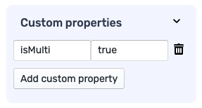

import listOfSuggestionsVideo from '../assets/15564803.mov';

# Handling lists

## List of inputs

The most basic list would be a list of inputs. It looks as follows:

<video controls>
  <source src={listOfSuggestionsVideo} />
</video>
 

To convert field to list field, you need to set `isMulti` to `true` in the `Custom properties` section.

