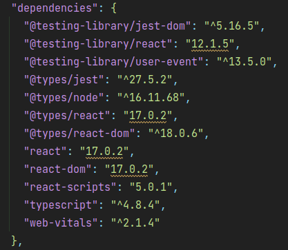
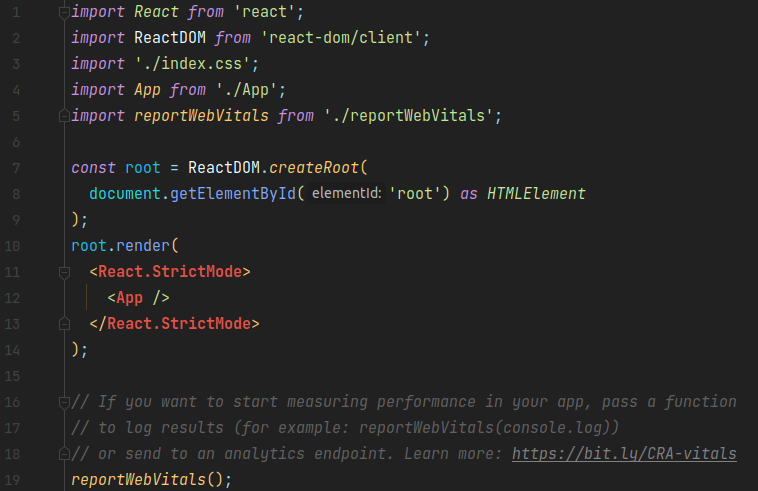
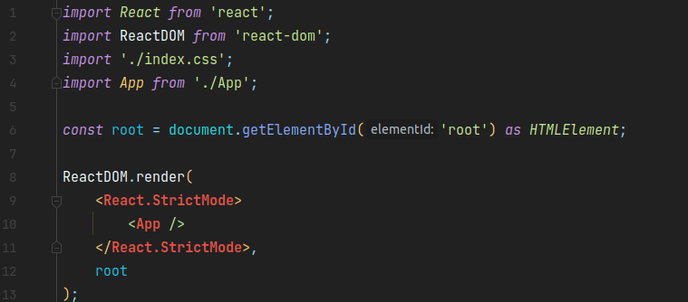
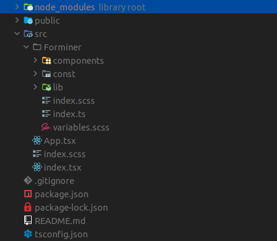
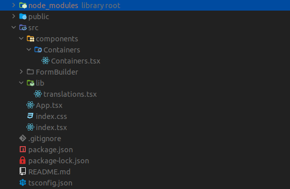
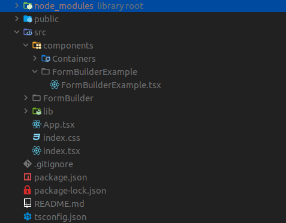
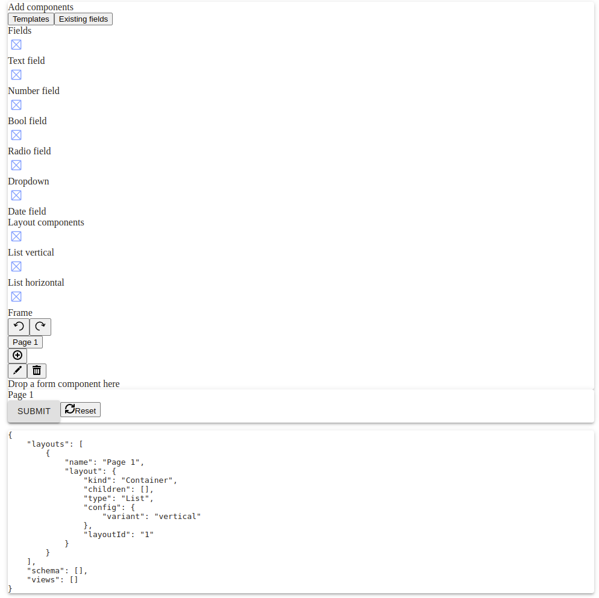
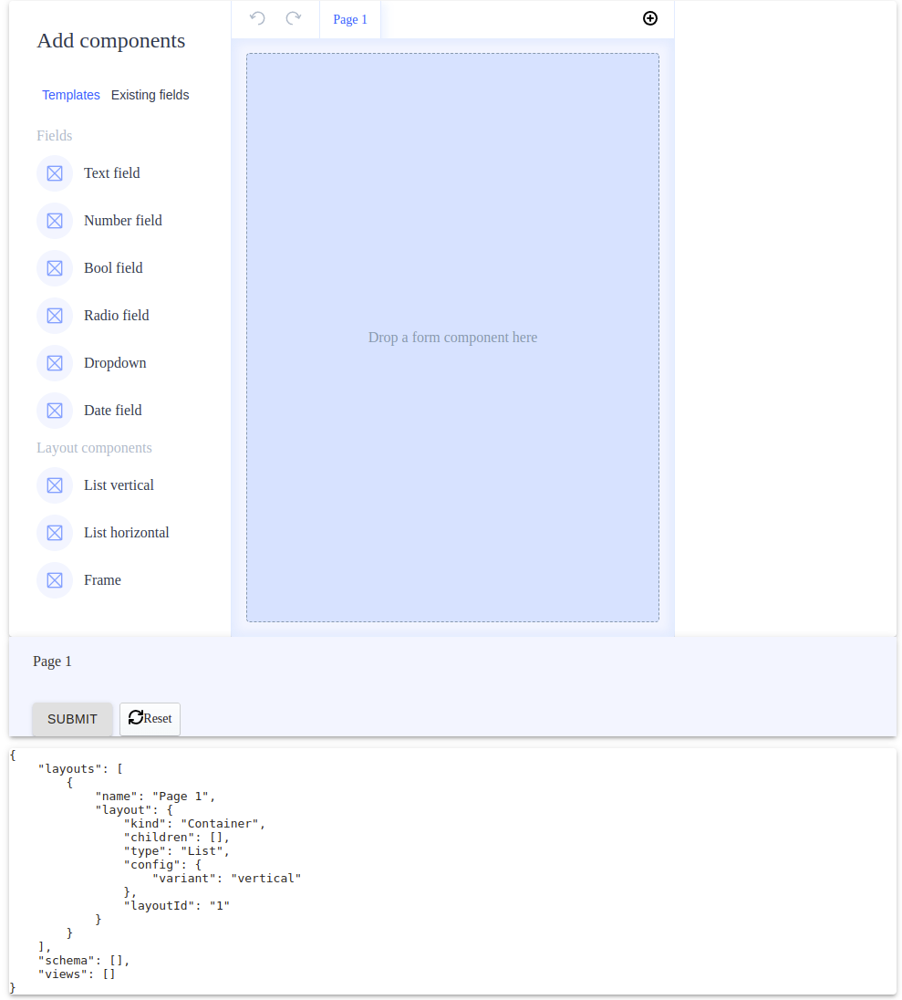
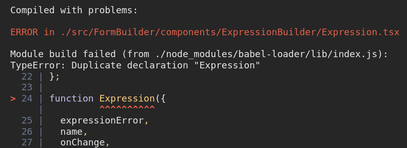
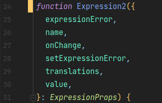

# Installation

In this section, we will walk through FB's installation process on the [CRA](https://create-react-app.dev/) (create-react-app) example.

1.  Ensure you have the right versions of node and npm  
    Look at [Technical requirements (versions)](technical-requirements.mdx).
2.  Create a new project with a typescript template

    ```shell
    $ npx create-react-app [project-name] --template typescript
    ```

3.  Ensure you have the right versions of `react` and `react-dom`  
    Look at [Technical requirements (versions)](technical-requirements.mdx).

    If your `react` and `react-dom` versions are correct skip this point, otherwise if they are higher than those mentioned in the article above you have to downgrade them. To do so:  
    a) Change the packages' versions in the `package.json` to be:

    ```json
    "@testing-library/react": "12.1.5",
    "@types/react": "17.0.2",
    "react": "17.0.2",
    "react-dom": "17.0.2",
    ```

    The dependencies sections should look as follows:

    

    b) Remove `package-lock.json` file (be careful and **do not** delete `package.json` file) and `node_modules` directory.

    c) Install dependencies

    To do so run the command:

    ```shell
    npm i
    ```

    d) Check your `index.tsx` file

    If your file has a code that uses `ReactDOM.createRoot`:

    

    update it to look as follows:

    

4.  Install required dependencies

    ```shell
    npm i --save-exact ajv@7.1.1 ajv-errors@2.0.0 ajv-formats@1.5.1 classnames@2.2.6 react-dnd@14.0.4 react-dnd-html5-backend@14.0.2 react-dnd-mouse-backend@1.0.0-rc.2 react-dnd-multi-backend@6.0.2 react-dnd-touch-backend@14.1.1 react-popper@1.3.11 uniforms@3.4.0 uniforms-bridge-json-schema@3.4.0

    npm i --save-exact --save-dev @types/classnames@2.2.11 @types/lodash@4.14.168 @types/invariant@2.2.34
    ```

    Remember to add `--save-exact` flag in order to install packages at exact versions.

    **Watch out!**  
    If you're using `npm` at a version higher than `16.14.17` (not recommended) apart from `--save-exact` flag you will also have to add `--legacy-peer-deps`. The command will look as follows:

    ```shell
    npm i --save-exact --legacy-peer-deps ajv@7.1.1 ajv-errors@2.0.0 ...
    ```

5.  Copy and paste the `FormBuilder` directory to the `[project-name]/src`

    

6.  Create FormBuilder's helpers

    As your `FormBuilder` folder is already present in the `src` directory, now it's time to add `Containers` and `translations`.

    a) Create `Containers.tsx` file in `src/components/Containers`

    

    Example code for `Containers.tsx` can be copied and pasted as below:

```tsx
import React, { CSSProperties, Fragment } from 'react';
import classNames from 'classnames';

import { Field as FieldType } from '../../FormBuilder//const/schemas/field';
import { DragSeparator } from '../../FormBuilder/components/DragSeparator';
import { render as renderLive } from '../../FormBuilder/components/Form';
import { render as renderEdit } from '../../FormBuilder/components/FormEdit';
import { LayoutPlaceholder } from '../../FormBuilder/components/LayoutPlaceholder';
import { NS } from '../../FormBuilder/const/namespace';
import { LayoutNode } from '../../FormBuilder/const/schemas/layout';
import { View } from '../../FormBuilder/const/schemas/view';
import { Translations } from '../../FormBuilder/const/types';
import { ComponentDefinitions } from '../../FormBuilder';
import { ContainerDefinitions } from '../../FormBuilder/lib/containerDefinitions';
import isLayoutNodeField from '../../FormBuilder/lib/isLayoutNodeField';
import { WidgetDefinitions } from '../../FormBuilder/lib/widgetDefinitions';

type ListProps = {
  children: LayoutNode[];
  components: ComponentDefinitions;
  containers: ContainerDefinitions;
  depth: number;
  droppableId: string;
  isDragging: boolean;
  isRoot: boolean;
  nestedDroppableBase: string;
  path: string;
  schema: FieldType[];
  type: string;
  translations: Translations;
  variant: 'horizontal' | 'vertical';
  views: View[];
  widgets: WidgetDefinitions;
};

type FrameProps = {
  children: LayoutNode[];
  components: ComponentDefinitions;
  containers: ContainerDefinitions;
  depth: number;
  droppableId: string;
  isDragging: boolean;
  isRoot: boolean;
  nestedDroppableBase: string;
  path: string;
  schema: FieldType[];
  style: CSSProperties;
  translations: Translations;
  views: View[];
  widgets: WidgetDefinitions;
};

const containers: ContainerDefinitions = {
  List: {
    componentEdit: function List({
      children,
      components,
      containers,
      depth,
      droppableId,
      isDragging,
      isRoot,
      nestedDroppableBase,
      path,
      schema,
      type,
      translations,
      variant,
      views,
      widgets,
    }: ListProps) {
      const containerType = variant + type;
      return (
        <div
          className={classNames(
            `${NS}-${containerType}`,
            `${NS}-${containerType}--edit`,
            {
              [`${NS}-full-height`]: isRoot && children.length === 0,
            },
          )}
        >
          {children.length === 0 && (
            <LayoutPlaceholder
              droppableId={droppableId}
              fitAvailable={isRoot}
              isDragging={isDragging}
              type={containerType}
              translations={translations}
            />
          )}

          {children.length > 0 && (
            <div
              className={classNames(
                `${NS}-${containerType}`,
                `${NS}-${containerType}--edit`,
              )}
            >
              {children.map((layout, index) => (
                <div
                  className={classNames(
                    `${NS}-dnd-draggable`,
                    `${NS}-dnd-draggable-${containerType}`,
                  )}
                  key={layout.layoutId}
                >
                  <>
                    {!isDragging && (
                      <DragSeparator
                        droppableId={`${nestedDroppableBase}${index}`}
                        type={containerType}
                      />
                    )}
                    {renderEdit({
                      components,
                      depth: depth + 1,
                      layout,
                      path: `${path}.children.${index}`,
                      schema,
                      translations,
                      views,
                      widgets,
                      containers,
                    })}
                  </>
                </div>
              ))}

              {!isDragging && (
                <DragSeparator
                  droppableId={`${nestedDroppableBase}${children.length}`}
                  isRoot={isRoot}
                  isLast
                  type={containerType}
                />
              )}
            </div>
          )}
        </div>
      );
    },
    componentLive: function List({
      children,
      components,
      containers,
      depth,
      path,
      schema,
      type,
      variant,
      views,
      widgets,
    }: ListProps) {
      const containerType = variant + type;
      return (
        <div className={`${NS}-${containerType}`}>
          {children.map((layout, index) => {
            const id = isLayoutNodeField(layout)
              ? `${layout.viewId}${index}${depth}`
              : `${index}${depth}`;

            return (
              <Fragment key={id}>
                {renderLive({
                  components,
                  containers,
                  depth: depth + 1,
                  layout,
                  path: `${path}.children.${index}`,
                  schema,
                  views,
                  widgets,
                })}
              </Fragment>
            );
          })}
        </div>
      );
    },
    configSchema: {
      type: 'object',
      properties: {
        variant: { type: 'string', enum: ['horizontal', 'vertical'] },
      },
      required: ['variant'],
    },
  },
  Frame: {
    componentEdit: function Frame({
      children,
      components,
      containers,
      depth,
      droppableId,
      isDragging,
      isRoot,
      nestedDroppableBase,
      path,
      schema,
      style,
      translations,
      views,
      widgets,
    }: FrameProps) {
      const containerType = 'Frame';
      return (
        <div
          className={classNames(
            `${NS}-${containerType}`,
            `${NS}-${containerType}--edit`,
            {
              [`${NS}-full-height`]: isRoot && children.length === 0,
            },
          )}
        >
          <div style={{ border: `${style}` }}>
            {children.length === 0 && (
              <LayoutPlaceholder
                droppableId={droppableId}
                fitAvailable={isRoot}
                isDragging={isDragging}
                type={containerType}
                translations={translations}
              />
            )}

            {children.length > 0 && (
              <div
                className={classNames(
                  `${NS}-${containerType}`,
                  `${NS}-${containerType}--edit`,
                )}
              >
                <div
                  className={classNames(
                    `${NS}-dnd-draggable`,
                    `${NS}-dnd-draggable-${containerType}`,
                  )}
                  key={children[0].layoutId}
                >
                  {!isDragging && (
                    <DragSeparator
                      droppableId={`${nestedDroppableBase}0`}
                      type={containerType}
                    />
                  )}
                  {renderEdit({
                    components,
                    depth: depth + 1,
                    layout: children[0],
                    path: `${path}.children.0`,
                    schema,
                    translations,
                    views,
                    widgets,
                    containers,
                  })}
                </div>

                {!isDragging && (
                  <DragSeparator
                    droppableId={`${nestedDroppableBase}0`}
                    isRoot={isRoot}
                    isLast
                    type={containerType}
                  />
                )}
              </div>
            )}
          </div>
        </div>
      );
    },
    componentLive: function Frame({
      children,
      components,
      containers,
      depth,
      path,
      schema,
      style,
      views,
      widgets,
    }: FrameProps) {
      return children.length > 0 ? (
        <div className={`${NS}-field-container`}>
          <div style={{ border: `${style}` }}>
            <Fragment>
              {renderLive({
                components,
                containers,
                depth: depth + 1,
                layout: children[0],
                path: `${path}.children.0`,
                schema,
                views,
                widgets,
              })}
            </Fragment>
          </div>
        </div>
      ) : null;
    },
    configSchema: {
      type: 'object',
      properties: {
        style: { type: 'string' },
      },
    },
  },
};

export default containers;
```

b) Create `translations.tsx` file in `src/lib`



Example code for `translations.tsx` can be copied and pasted as below:

```tsx
import React from 'react';

import { NS } from '../FormBuilder/const/namespace';
import { Translations } from '../FormBuilder/const/types';

const translations: Translations = {
  AddComponents: 'Add components',
  AddCondition: 'Add condition',
  AddCustomProperty: 'Add custom property',
  AddCustomStyle: 'Add custom style',
  AddInitialExpression: 'Add initial expression',
  AddLevel: 'Add level',
  AddPredefinedValue: 'Add predefined value',
  AddToSection: 'Add to section',
  Advanced: 'Advanced',
  Basic: 'Basic',
  BoolField: 'Bool field',
  ComponentLabel: 'Component',
  ComponentTooltip: 'Select the component to be used in the form',
  CreateNewCustomComponentTooltip: 'Create new custom component',
  CustomComponents: 'Custom components',
  CustomErrorMessages: 'Custom error messages',
  CustomErrorMessageConstLabel: 'Const',
  CustomErrorMessageDefaultLabel: 'Default',
  CustomErrorMessageEnumLabel: 'Predefined values error',
  CustomErrorMessageFormatLabel: 'Format',
  CustomErrorMessageMaximumLabel: 'Maximum',
  CustomErrorMessageMaxLengthLabel: 'Max length',
  CustomErrorMessageMinimumLabel: 'Minimum',
  CustomErrorMessageMinLengthLabel: 'Min length',
  CustomErrorMessageMultipleOfLabel: 'Multiple of',
  CustomErrorMessagePatternLabel: 'Pattern',
  CustomErrorMessageRequiredLabel: 'Required',
  CustomProperties: 'Custom properties',
  CustomStyles: 'Custom styles',
  Cancel: 'Cancel',
  Confirm: 'Confirm',
  ContainerName(type, variant) {
    return variant ? `${type} ${variant}` : type;
  },
  DateField: 'Date field',
  DefaultValueLabel: 'Default value',
  DeleteAllPredefinedValues: 'Delete all predefined values',
  DisplayIf: 'Display if',
  DisplayIfTitle(name: string) {
    return (
      <>
        Display <span className={`${NS}-display-if-title-field`}>{name}</span>{' '}
        if
      </>
    );
  },
  DisplayIfTooltip:
    'Define the conditions when the given field should be displayed',
  Dropdown: 'Dropdown',
  DropFormComponent: 'Drop a form component here',
  DuplicateField: 'Duplicate field',
  DuplicateFieldTooltip: 'Duplicate field',
  EditComponent: 'Edit component',
  EditField: 'Edit field',
  EditFieldTooltip: 'Edit field',
  EditItem: 'Edit item',
  EditLayoutComponent: 'Edit layout component',
  EditPageName: 'Edit page name',
  EditSection: 'Edit section',
  ErrorDefinitionNotFound: 'Definition not found: "AutoForm".',
  ErrorFieldNotFound(fieldId) {
    return `Field not found: "${fieldId}".`;
  },
  ErrorViewNotFound(viewId) {
    return `View not found: "${viewId}".`;
  },
  ExistingFields: 'Existing fields',
  Field: 'field',
  Fields: 'Fields',
  Frame: 'Frame',
  FormatLabel: 'Format',
  FormatTooltip: 'Select format of value of the field',
  Horizontal: 'Horizontal',
  Is: 'is',
  LabelLabel: 'Label',
  LayoutComponents: 'Layout components',
  LayoutTitle(layoutNodeKind) {
    return `${layoutNodeKind}`;
  },
  ListHorizontal: 'Horizontal section',
  ListVertical: 'Vertical section',
  LiteralFalse: 'False',
  LiteralTrue: 'True',
  MaximumLabel: 'Maximum',
  MaximumTooltip: 'Define maximum value of the field',
  MaxLengthLabel: 'Max length',
  MaxLengthTooltip: 'Define maximum number of characters in a field',
  MinimumLabel: 'Minimum',
  MinimumTooltip: 'Define minimum value of the field',
  MinLengthLabel: 'Min length',
  MinLengthTooltip: 'Define minimum number of characters in a field',
  MultipleOfLabel: 'Multiple of',
  MultipleOfTooltip:
    'The field value should be a multiple of a value defined in this field',
  NameInSchemaLabel: 'Name in schema',
  ModelErrorsMessage: 'Your model contains errors',
  NextPage: 'Next Page',
  NumberField: 'Number field',
  OfTheFollowingAreTrue: 'of the following are true',
  OperatorAND: 'Every',
  OperatorBooleanLiteral: 'Arbitrary boolean',
  OperatorEQ: 'Equal to',
  OperatorGTE: 'Greater than or equal to',
  OperatorGT: 'Greater than',
  OperatorLengthOf: 'Length of',
  OperatorLTE: 'Less than or equal to',
  OperatorLT: 'Less than',
  OperatorNAND: 'Not every',
  OperatorNOR: 'None',
  OperatorNotEQ: 'Not equal to',
  OperatorNumberLiteral: 'Arbitrary number',
  OperatorOR: 'Some',
  OperatorStringLiteral: 'Arbitrary string',
  OperatorValueOf: 'Value of',
  OperatorXOR: 'Only one',
  PageNameLabel: 'Name',
  PagesLongForm: (
    <>
      <div style={{ fontWeight: 'bold' }}>
        That looks like quite a long form!
      </div>
      <br />
      <div>
        Consider spreading your fields into pages to make your form more
        accessible.
      </div>
    </>
  ),
  PatternLabel: 'Pattern',
  PatternTooltip: 'Define regular expressions pattern',
  PlaceholderLabel: 'Placeholder',
  PlaceholderMax: 'max',
  PlaceholderMin: 'min',
  PreDefinedValues: 'Pre-defined values',
  PropertiesTooltip:
    'Add props which will be implemented in the given Field.JSON format',
  RadioField: 'Radio field',
  Redo: 'Redo',
  RemoveComponent: 'Remove component',
  RemoveField: 'Remove field',
  RemoveFieldTooltip: 'Remove field',
  RemoveItem: 'Remove item',
  RemovePage: 'Remove Page',
  RemovePageConfirmation(pageNumber) {
    return `Are you sure you want to remove entire Page ${pageNumber}? Your fields might be lost.`;
  },
  RequiredLabel: 'Required',
  RequiredTrueLabel: 'Must be true',
  Reset: 'Reset',
  SearchPlaceholder: 'Search for components',
  StyleTooltip:
    'Define CSS styles to be used in rendered container of the field.JSON format',
  Submit: 'Submit',
  Templates: 'Templates',
  TextField: 'Text field',
  Type: 'Type',
  TypeLabel: 'Type',
  TypeTooltip: 'Pick what kind of data will be stored in this field',
  Undo: 'Undo',
  ValueRestrictions: 'Value restrictions',
  Vertical: 'Vertical',
  VisualEditor: 'Visual Editor',
};

export default translations;
```

7\. Add `FormBuilderExample`

a) Select a [uniforms](https://uniforms.tools/) theme

At this point, you will need one of the uniforms themes. You can check the list of themes [here](https://uniforms.tools/docs/installation/).  
You can install any theme, but remember to install it at `3.4.0` version.

For the purpose of this installation example, we will proceed with `uniforms-material` theme. To do it run the command:

```shell
npm i --save-exact uniforms-material@3.4.0
```

In the example, the Material UI components will also be used so let's install it too.

```shell
npm i --save-exact @material-ui/core@4.11.3
```

b) Create `FormBuilderExample.tsx` file in `src/components/FormBuilderExample`



c) Add the component's code

In the `FormBuilderExample.tsx` you can copy and paste the following code:

```tsx
import React, { useEffect, ReactNode, ReactElement } from 'react';
import Container from '@material-ui/core/Container';
import List from '@material-ui/core/List';
import Paper from '@material-ui/core/Paper';
import * as theme from 'uniforms-material';

import {
  FormBuilder,
  Provider,
  createDefaultComponents,
  useFormBuilder,
  LayoutNodeKind,
  Form,
} from '../../FormBuilder';
import containers from '../Containers/Containers';
import translations from '../../lib/translations';

const defaultForm = {
  model: {
    layouts: [
      {
        name: 'Page 1',
        layout: {
          kind: LayoutNodeKind.Container as const,
          children: [],
          type: 'List',
          config: { variant: 'vertical' },
          layoutId: '1',
        },
      },
    ],
    schema: [],
    views: [],
  },
};

type WrapProps = {
  children: ReactNode;
};

const Wrap = ({ children }: WrapProps): ReactElement => (
  <Container maxWidth={false}>
    <Paper elevation={3}>{children}</Paper>
  </Container>
);

const widgets = {};
const components = createDefaultComponents(theme);

export const FormBuilderExample = (): ReactElement => {
  const { dispatch, state } = useFormBuilder(defaultForm);

  useEffect(() => {
    // do whatever you want with new model
    console.log(state.model.present);
  }, [state.model.present]);

  return (
    <>
      <Wrap>
        <Provider dispatch={dispatch} state={state}>
          <FormBuilder
            components={components}
            containers={containers}
            translations={translations}
            widgets={widgets}
          />
        </Provider>
      </Wrap>
      <Wrap>
        <Form
          components={components}
          containers={containers}
          definition={state.model.present}
          widgets={widgets}
          translations={translations}
        />
      </Wrap>
      <Wrap>
        <pre>{JSON.stringify(state.model.present, null, 4)}</pre>
      </Wrap>
    </>
  );
};

export default FormBuilderExample;
```

d) Update `App.tsx` code

Go to `src/App.tsx` file and paste the code as follows:

```tsx
import React, { ReactElement } from 'react';
import FormBuilderExample from './components/FormBuilderExample/FormBuilderExample';

const App = (): ReactElement => {
  return <FormBuilderExample />;
};

export default App;
```

e) Run the application

Use command:

```shell
npm start
```

Then, verify your application works as expected. You should see the view presented below:



If you will encounter problems running the app at this point please look at the [FormBuilder problems solving](#formbuilder-problems-solving).

f) Add styles

The last part of the installation process is to add the required styles to make FB look the expected way.

- Install [Sass](https://www.npmjs.com/package/sass). Use the following command:

```shell
npm i sass
```

- Rename `src/index.css` file to `index.scss`
- Update `index.scss` file content to be:

```sass
@import './FormBuilder/variables.scss';
@import './FormBuilder/index.scss';
```

- Update `src/index.tsx` file  
  Change `import './index.css';` to `import './index.scss';`
- Rerun the application



From now on you can generate the FormBuilder's code! Have fun!

### FormBuilder problems solving

1\. To run the app with no issues currently, it's needed to update the `tsconfig.json` file and add:

```json
  "include": []
```

Next, solve the known issues listed below:

a) Duplicate declaration "Expression" error



Go to `src/FormBuilder/components/ExpressionBuilder/Expression.tsx` file and change `Expression` function name to any other, for example, `Expression2`.




b) Export was not found errors


Go to `src/FormBuilder/components/uniforms/index.ts` file and change the file as follows:

```tsx
export { default as AutoField } from './AutoField';
export type { AutoFieldProps } from './AutoField';
export { default as AutoFields } from './AutoFields';
export type { AutoFieldsProps } from './AutoFields';
export { default as AutoForm } from './AutoForm';
export { default as BaseForm } from './BaseForm';
export { default as BoolField } from './BoolField';
export type { BoolFieldProps } from './BoolField';
export { default as DateField } from './DateField';
export type { DateFieldProps } from './DateField';
export { default as ErrorField } from './ErrorField';
export type { ErrorFieldProps } from './ErrorField';
export { default as ErrorsField } from './ErrorsField';
export type { ErrorsFieldProps } from './ErrorsField';
export { default as HiddenField } from './HiddenField';
export type { HiddenFieldProps } from './HiddenField';
export { default as ListAddField } from './ListAddField';
export type { ListAddFieldProps } from './ListAddField';
export { default as ListDelField } from './ListDelField';
export type { ListDelFieldProps } from './ListDelField';
export { default as ListField } from './ListField';
export type { ListFieldProps } from './ListField';
export { default as ListItemField } from './ListItemField';
export type { ListItemProps } from './ListItemField';
export { default as LongTextField } from './LongTextField';
export type { LongTextFieldProps } from './LongTextField';
export { default as NestField } from './NestField';
export type { NestFieldProps } from './NestField';
export { default as NumField } from './NumField';
export type { NumFieldProps } from './NumField';
export { default as QuickForm } from './QuickForm';
export { default as RadioField } from './RadioField';
export type { RadioFieldProps } from './RadioField';
export { default as SelectField } from './SelectField';
export type { SelectFieldProps } from './SelectField';
export { default as SubmitField } from './SubmitField';
export type { SubmitFieldProps } from './SubmitField';
export { default as TextField } from './TextField';
export type { TextFieldProps } from './TextField';
export { default as ValidatedForm } from './ValidatedForm';
export { default as ValidatedQuickForm } from './ValidatedQuickForm';
```

2\. Issues with `tsconfig.json` that includes `src` directory, for example:

```json
{
  "compilerOptions": {
    "target": "es2019",
    "lib": ["dom", "dom.iterable", "es2019"],
    "allowJs": true,
    "skipLibCheck": true,
    "esModuleInterop": true,
    "allowSyntheticDefaultImports": true,
    "strict": true,
    "forceConsistentCasingInFileNames": true,
    "noFallthroughCasesInSwitch": true,
    "module": "commonjs",
    "moduleResolution": "node",
    "resolveJsonModule": true,
    "isolatedModules": true,
    "noEmit": true,
    "jsx": "react-jsx"
  },
  "include": ["src/**/*"]
}
```

Currently, we trying our best to resolve all remaining issues connected with TypeScript validation.
