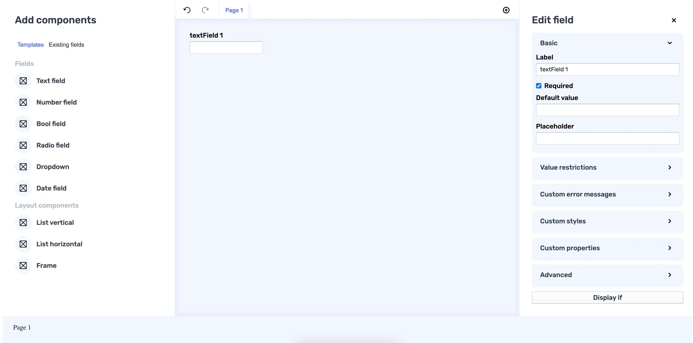

# Integration deep dive

In this section, we will walk through the Forminer integration process on the [Vite](https://vitejs.dev/) example.

## Prerequistences

In this example, we will use Node and NPM with specific versions as below.

```shell
$ node --version
20.11.0
```

```shell
$ npm --version
10.4.0
```

## Create a new project

Create a new project with a typescript template.

```shell
npm create vite@latest forminer-vite -- --template react-ts # extra double-dash is needed
```

Install dependencies

```shell
cd forminer-vite && npm install
```

Forminer requires `react` and `react-dom` in versions `18.x`.

```shell
npm install react@18 react-dom@18
npm install --save-dev @types/react@18 @types/react-dom@18
```

You can clean up and remove unnecessary files.

```shell
rm -r ./src/assets ./src/App.css ./src/index.css
```

Update the App.tsx file to have an empty component.

```tsx
function App() {
  return null;
}

export default App;
```

Remove style import from `main.tsx` and `React.StrictMode` (for more information, please check [Troubleshooting](troubleshooting.mdx)).

```tsx
import React from 'react';
import ReactDOM from 'react-dom/client';
import App from './App.tsx';
// highlight-next-line-removed
import './index.css';

ReactDOM.createRoot(document.getElementById('root')!).render(
  {/* highlight-next-line-removed */}
  <React.StrictMode>
    <App />
  {/* highlight-next-line-removed */}
  </React.StrictMode>,
);
```

You should end up with the following project structure.

```
┌── public
│   ├── vite.svg
├── src
│   ├── App.tsx
│   ├── main.tsx
│   └── vite-env.d.ts
├── .eslintrc.cjs
├── .gitignore
├── index.html
├── package.json
├── README.md
├── tsconfig.json
├── tsconfig.node.json
└── vite.config.ts
```

## Install dependencies

### Install Forminer

Unzip the `forminer` file, copy the directory to `forminer-vite/packages/forminer` and install it.

```bash
npm install ./packages/forminer
```

### Install uniforms theme

At this point, you will need one of the uniforms themes. The list of themes is [here](https://uniforms.tools/docs/getting-started/installation/). You can install any theme, but remember to install it with the `4.0.0-beta.5` version.

For the purpose of this installation example, we will proceed with the `uniforms-mui` theme. To do it, run the command:

```shell
npm install --save-exact uniforms-mui@4.0.0-beta.5
```

### Install Material UI

In the example, the Material UI components will also be used so let's install them too.

```shell
npm install @mui/material@6.5.0 @emotion/react @emotion/styled
```

Material UI uses the Roboto font by default.

```shell
npm install @fontsource/roboto
```

Then you can import it in your entry point (`src/main.tsx`) like this:

```css
import '@fontsource/roboto/300.css';
import '@fontsource/roboto/400.css';
import '@fontsource/roboto/500.css';
import '@fontsource/roboto/700.css';
```

### Add Forminer component

Go to `src/App.tsx` file and paste the code as follows.

```tsx
import {
  createDefaultComponents,
  Form,
  Forminer,
  Provider,
  useForminer,
} from 'forminer';
import * as theme from 'uniforms-mui';
import 'forminer/dist/index.css';

const components = createDefaultComponents(theme);

function App() {
  const { dispatch, state } = useForminer();

  return (
    <>
      <Provider dispatch={dispatch} state={state}>
        <Forminer />
      </Provider>
      <Form
        components={components}
        definition={state.model.present}
        onSubmit={model => alert(JSON.stringify(model, null, 2))}
      />
    </>
  );
}

export default App;
```

### Add styles to Forminer

Forminer doesn't ship with its font styles. It allows you to pick, which font should be applied. In this example, we will use Google's Rubik font.

Create a new `styles.css` file in the `src/styles.css`.

```css
@import url('https://fonts.googleapis.com/css2?family=Rubik:wght@400;500&display=swap');

body {
  font-family: Rubik, sans-serif;
  font-weight: 400;
}
```

Then, import it into the `App.tsx` file.

```tsx
import './styles.css';
```

### Run the application

Use a command:

```shell
npm run dev
```

Then, verify your application works as expected. You should see the view presented below:



### Troubleshooting

If you have problems running the application, please check the [Troubleshooting](troubleshooting.mdx) page.
