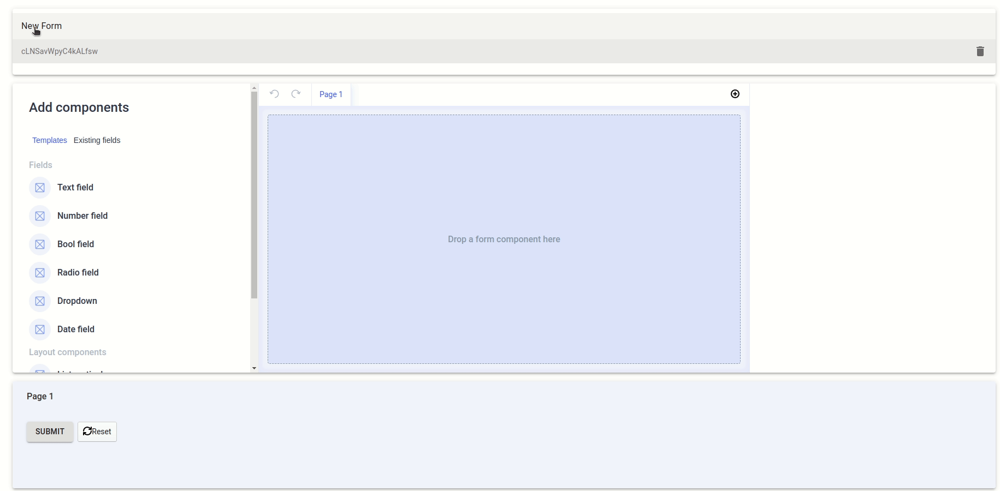

import mapFieldVideo from '../../assets/10158082.mp4';

# Handling custom components

By default, Forminer provides a set of essential components for handling form fields, such as inputs, dropdowns, checkboxes, etc.

These are the built-in components provided in any of the official uniforms themes. The complete list is available [here](https://uniforms.tools/docs/api-fields).

Even the basic set of components is a powerful tool for creating complex forms, but we understand that sometimes it is not enough. What if you need a dropdown that needs to fetch options from the API? What if your form requires an address and you want to handle it by selecting a point on the map?

The answer to these questions is custom fields.

To start using custom fields you need to:

1. Create a custom field.

2. Pass the custom field definition to your `Forminer` and `Form`s.

## Creating a custom field

You can easily expand the basic set of form fields by creating your own, freely customizable, custom fields. The only requirement is that they need to be uniforms-compatible. Such fields can be created using the two helpers provided by uniforms: [connectField](https://uniforms.tools/docs/api-helpers/#connectfield) and [useField](https://uniforms.tools/docs/api-helpers/#usefield).

Both provide various props related to form management and allow hook your component to the form. The difference between the helpers is that the former is a component wrapper, whereas the latter is its hook version.

Take a look at this example implementation of the custom dropdown that loads options from a remote source, in this case, films from a Star Wars API.

```tsx
import React, { useEffect, useState } from 'react';
import { HTMLFieldProps, useField } from 'uniforms';

type StarWarsMovieFieldProps = HTMLFieldProps<string, HTMLSelectElement, {}>;

export function StarWarsMovieField(props: StarWarsMovieFieldProps) {
  const [{ label, onChange, placeholder, value }] = useField(props.name, props);
  const [films, setFilms] = useState([]);

  useEffect(() => {
    const fetchData = async () => {
      const res = await fetch('https://swapi.dev/api/films');
      const json = await res.json();

      setFilms(json.results);
    };

    fetchData();
  }, []);

  return (
    <label>
      {label}
      <div>
        <select value={value} onChange={event => onChange(event.target.value)}>
          <option value="">{placeholder}</option>
          {films.map(({ title }) => (
            <option key={title} value={title}>
              {title}
            </option>
          ))}
        </select>
      </div>
    </label>
  );
}
```

## Passing a custom field definition to the `Forminer` and `Form`s

Once your custom fields are ready, you need to pass this information on to `Forminer` and your `Form`s. Both accept a `components` prop, which is a map of component definitions. A component definition is a React component itself and other options needed to render it correctly. The default configuration is described in the `createDefaultComponents` function. To be able to use a custom field, we add it to the existing component map:

```tsx
import * as theme from 'uniforms-material';
import { FieldType, createDefaultComponents } from '../Forminer';

const components = createDefaultComponents(theme);

components.StarWarsMovieField = {
  component: StarWarsMovieField,
  dataTypes: [FieldType.String],
};
```

Notice the `dataTypes` property above. It represents the data types that the component is capable of handling. In this case, it means that the StarWarsMovieField can handle string values. The `dataTypes` property also allows you to group the components capable of handling the field, by the field's type. In other words, if you set `dataTypes` to string, your component will appear in the list of selectable components that support this type in the Advanced section in the UI. If you provide multiple types in the `dataTypes` (e.g. string and number), then in both cases it will be possible to select this component to handle the field. If you leave the array empty, you won't be able to select the component to handle your field from the UI.

It is worth mentioning that in the same way, you can also override standard fields, such as TextField.

## Using a custom field

With a custom field defined as above, you can go to your Forminer instance and create a new text field. Inside of Edit field pane scroll down to the Advanced section and expand it to see the Component dropdown. Select your custom component and you're ready to go!



## Example #2 - Map component

Another example of a custom field could be a map field. Let's say we need our form not only to display the map but also to allow users to pick the location and capture the coordinates. To do so, we can create a dedicated `MapField` component.

In the example below, we use the `GoogleMapReact` component from the `google-map-react` package to render a map and the `useField` hook from the `uniforms` package to let it manage the state. Apart from the map, we also display selected coordinates. Notice that we stringify and parse the object value, that's because Forminer handles only primitives.

```tsx
import GoogleMapReact from 'google-map-react';
import React from 'react';
import { HTMLFieldProps, useField } from 'uniforms';

type MapFieldProps = HTMLFieldProps<string, HTMLSelectElement>;

const mapDefaults = {
  center: { lat: 51.11243862359008, lng: 17.02195684736274 },
  zoom: 12,
};

const safeParse = (str: string) => {
  try {
    return JSON.parse(str);
  } catch (error) {
    return null;
  }
};

export function MapField(props: MapFieldProps) {
  const [{ label, onChange, value }] = useField(props.name, props);
  const coords = value ? safeParse(value) : null;

  return (
    <div>
      <label>{label}</label>
      <div style={{ display: 'flex', alignItems: 'center' }}>
        <div style={{ height: '200px', width: '200px' }}>
          <GoogleMapReact
            defaultCenter={mapDefaults.center}
            defaultZoom={mapDefaults.zoom}
            onClick={({ lat, lng }) => onChange(JSON.stringify({ lat, lng }))}
          />
        </div>
        <div>
          Coordinates:
          <pre>{JSON.stringify(coords, null, 2)}</pre>
        </div>
      </div>
    </div>
  );
}
```

Check the video below to see how to use the map component in the user interface:

<video controls>
  <source src={mapFieldVideo} />
</video>
